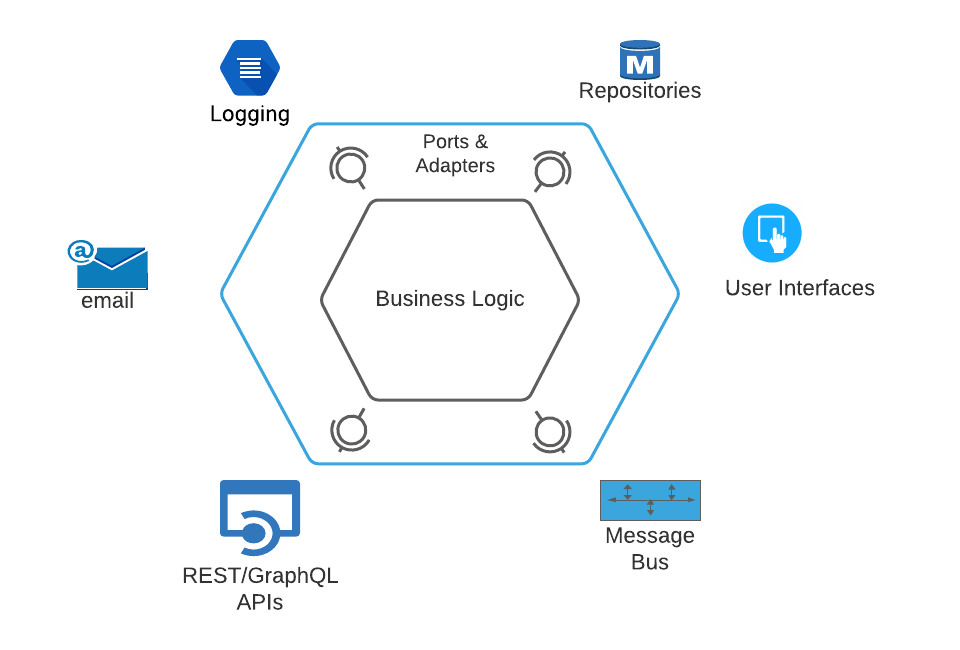

# A Hexagonal Software Architecture in Golang and Postgres
This presents a simple user microservice to demonstrate the principles of a hexagonal software architecture. The microservice exposes a RESTful API that allows consuming applications to perform CRUD operations. The microservice is developed in Golang and the user catalog data is kept in a Postgres repository.

